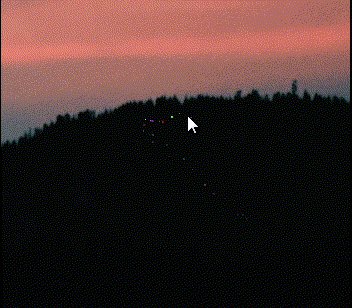
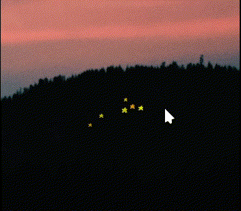
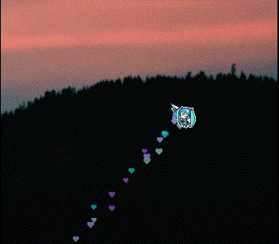

# Cursor particle effect for KWin

This effect for KDE Plasma 6 implements a configurable particle system that emits particles as the mouse cursor is moved across the screen. 

Tested on KDE Plasma 6.7.4 (Wayland), Qt 6.11.1.

## Parameters

- Frequency
- Duration
- Minimum and maximum size
- Minimum and maximum speed
- Angle 
- Texture support 
- Colorization
    - Randomized choice from a pool of colors
    - Full randomization








## Building

### Dependencies

- CMake
- extra-cmake-modules
- Ninja (optional)

```bash
$ cd path/to/this/repo
$ cmake -DCMAKE_INSTALL_PREFIX=/usr -G Ninja -B build . # '-G Ninja' is optional, but recommended for faster compilation
$ cmake --build build
$ sudo cmake --install build
```

## TODO

- Implement gravity
- Particle explosion on mouse click
- Test on higher refresh rates
- Improve rendering when changing brightness, contrast, HDR, and color-blindness
